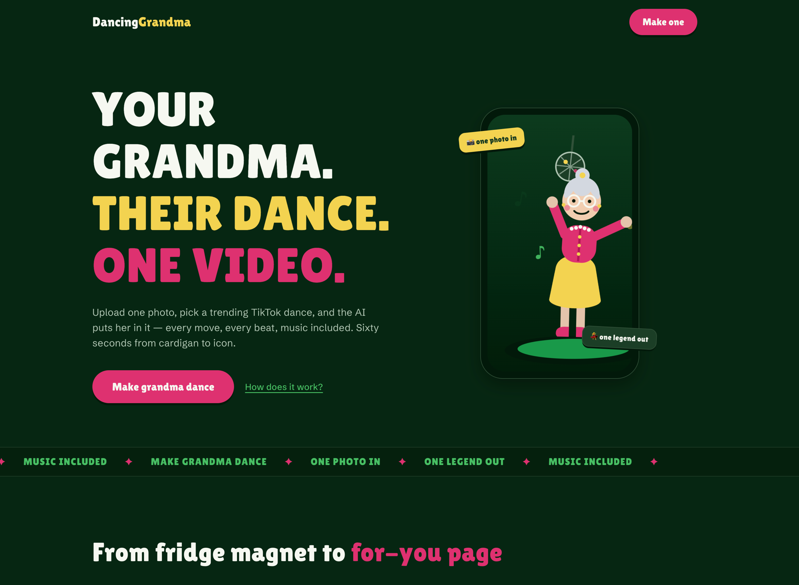

# DancingGrandma 💃

Upload one photo of grandma, pick a trending TikTok dance, and get a
motion-transfer character-animation video of her following the reference dance —
music included.



A Monterro InfuseAI demo. The full flow (photo → reference motion video → engine
→ result) is live; real renders run for uploaded, imported, and curated
reference clips when provider credentials are configured. The production
pipeline is a reference-video motion-transfer path that defaults to
[Kling 2.6 Motion Control](https://fal.ai/models/fal-ai/kling-video/v2.6/standard/motion-control)
served via fal.ai, with [Wan 2.2 Animate 14B](https://github.com/Wan-Video/Wan2.2)
(Apache 2.0) still available as a selectable alternative. Generic image-to-video
is not treated as a wired engine unless it accepts the reference motion video and
performs character animation or replacement.

## Run it

The whole stack — Next.js app, Postgres, blob storage (Azurite), Keycloak — is
orchestrated by [Aspire](https://aspire.dev) (`apphost.cs`):

```bash
npm install
cp .env.example .env.local                                  # fill in provider keys for local Next.js runs
cp appsettings.Development.json.example appsettings.Development.json  # fill in Azure provider values if testing that path
aspire run
```

The Aspire dashboard opens with links to the app, logs, and telemetry for every
resource. Docker must be running. To run just the Next.js app without the
platform pieces:

```bash
cp .env.example .env.local  # fill in FAL_KEY or REPLICATE_API_TOKEN for real renders
npm run dev
```

Open http://localhost:3000.

### What the apphost wires up

| Resource   | Local                        | Azure (`aspire publish`)          |
| ---------- | ---------------------------- | --------------------------------- |
| `web`      | `next dev`                   | Container App (standalone build)  |
| `postgres` | container + `db/init` schema | PostgreSQL Flexible Server        |
| `videos`   | Azurite blob container       | Storage account blob container    |
| `keycloak` | container + realm import     | Container App                     |
| Azure video provider | `SORA_*` env from parameters while the Azure path is coming soon | same, from deploy-time parameters |
| Front Door | —                            | `infra/frontdoor.bicep` → web     |

The database schema (`db/init/001-schema.sql`) holds **users**, their
**video generations**, and a **credits ledger** (balance = sum of transactions,
so it can't drift). Server-side access lives in `src/lib/server/`
(`db.ts`, `blob.ts`, `sora.ts`).

## Docs

- [Epic #3](https://github.com/phassle/DancingGrandma/issues/3) — full context & tracking; PRDs in [#1](https://github.com/phassle/DancingGrandma/issues/1) (product) and [#2](https://github.com/phassle/DancingGrandma/issues/2) (Phase 1 remaining work)
- [CONTEXT.md](CONTEXT.md) — canonical product vocabulary
- [PRODUCT.md](PRODUCT.md) — brand strategy & design principles
- [DESIGN.md](DESIGN.md) — visual system (color, type, motion)
- `src/lib/engines.ts` — the video-engine registry (add/flip engines here)

## Stack

Next.js 16 (App Router) · Tailwind CSS v4 · TypeScript. Designed with
[impeccable](https://impeccable.style).
